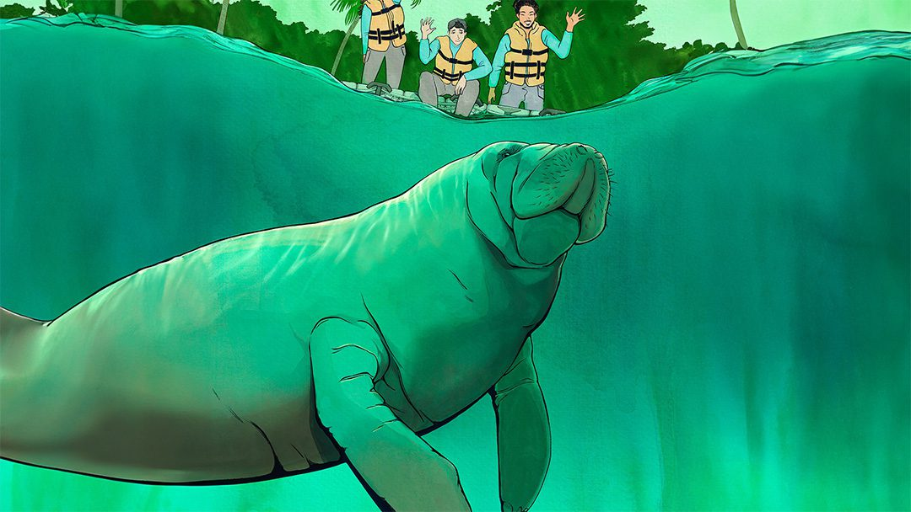

Oceanus Magazine published a feature on Tico's remarkable journey and on the role of ocean currents in understanding and supporting marine mammal conservation:
[Saving Tico](https://www.whoi.edu/oceanus/feature/saving-tico-manatee-rescue-ocean-currents-brazil/).

The story highlights the collaboration with AQUASIS and the oceanographic analysis used to show how the North Brazil Current shaped Tico's trajectory.

For the underlying scientific paper, see:
[The longest documented travel by a West Indian manatee](https://doi.org/10.1017/S0025315424000894),
published online by Cambridge University Press on October 29, 2024.
