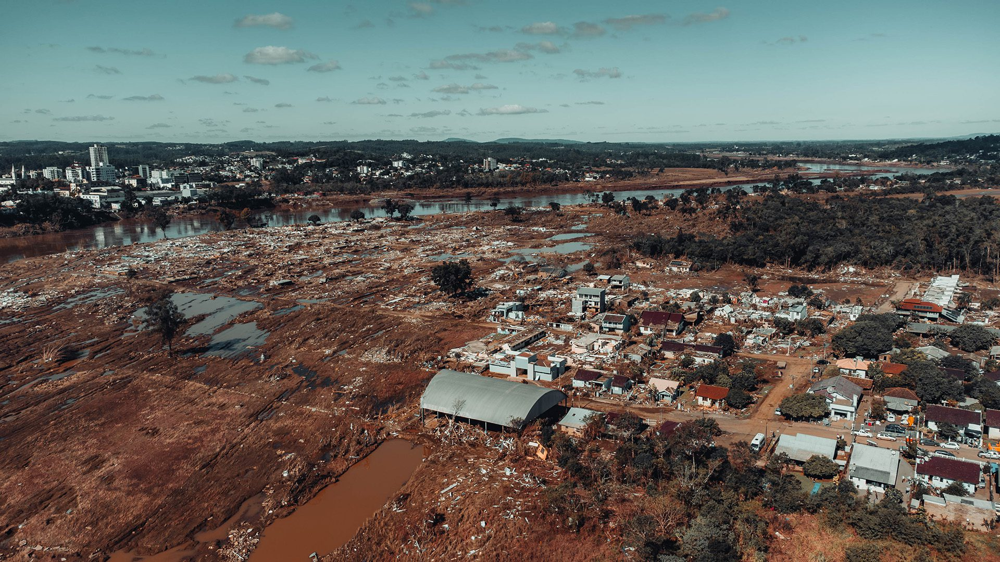

Oceanus Magazine published a feature on our work examining the May 2024 floods in southern Brazil and their environmental and social impacts:
[The human cost of Brazil's floods: New research maps social vulnerability after the 2024 deluge](https://www.whoi.edu/oceanus/feature/the-human-cost-of-brazils-floods-new-research-maps-social-vulnerability-after-the-2024-deluge/).

The article discusses how we used SWOT satellite observations together with topographic and socioeconomic datasets to quantify flood impacts, including effects on croplands and socially vulnerable communities.

For the scientific article, see:
[The May 2024 Flood Disaster in Southern Brazil: Causes, Impacts, and SWOT-Based Volume Estimation](https://doi.org/10.1029/2024GL112442),
published in *Geophysical Research Letters* on February 28, 2025.
