At the intersection of Data Science and Interdisciplinary Oceanography, my research leverages high-performance computational tools to analyze, model, and visualize oceanic and atmospheric processes. My expertise spans a diverse range of topics, from ocean vortices and extreme weather events to oceanographic influences on marine conservation.

I am passionate about uncovering scientific answers while also developing tools that empower other researchers and stakeholders to explore their own questions. My work extends beyond research, focusing on building open-source software that enhances data analysis, visualization, and accessibility for the broader scientific community.

---

## The Origins and Aftermath of Extreme Events

I use Earth and environmental sciences theory and computational methods to understand the causes and regional impacts of extreme events on ecosystems and human populations.

```{=html}
<div id="carouselExtremeEvents" class="carousel slide" data-bs-ride="carousel">
  <div class="carousel-inner">
    <div class="carousel-item active">
      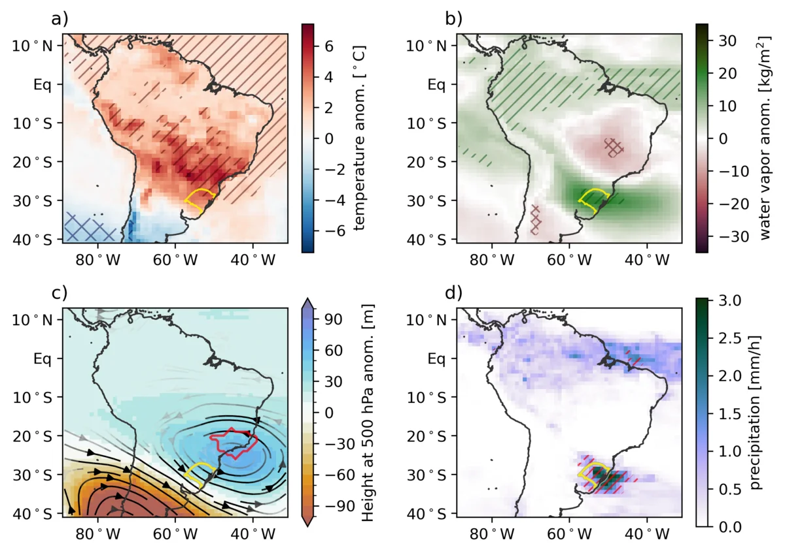
      <div class="carousel-caption">
        <p>Investigating atmospheric blocking using cloud computing for extreme weather analysis.</p>
      </div>
    </div>
    <div class="carousel-item">
      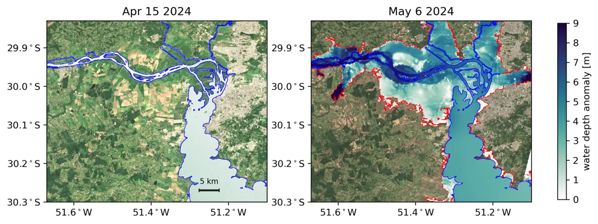
      <div class="carousel-caption">
        <p>SWOT Mission Data: Estimating extreme flood event volumes.</p>
      </div>
    </div>
    <div class="carousel-item">
      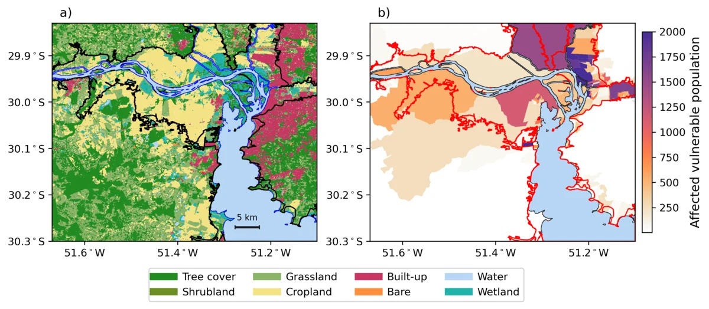
      <div class="carousel-caption">
        <p>Geophysical and Socioeconomic Data: Assessing extreme event impacts.</p>
      </div>
    </div>
  </div>
  <button class="carousel-control-prev" type="button" data-bs-target="#carouselExtremeEvents" data-bs-slide="prev">
    <span class="carousel-control-prev-icon"></span>
  </button>
  <button class="carousel-control-next" type="button" data-bs-target="#carouselExtremeEvents" data-bs-slide="next">
    <span class="carousel-control-next-icon"></span>
  </button>
</div>
```

---

## Satellite Data and Ocean Models for Wildlife Conservation

This research explores how oceanographic and atmospheric conditions impact the conservation of endangered species, using remote sensing and predictive modeling. The project originated with the study of Tico's journey—the longest recorded distance traveled by a released West Indian manatee—conducted in collaboration with AQUASIS.
This story was explored by a science communication article at [Oceanus Magazine (WHOI)](https://www.whoi.edu/oceanus/feature/saving-tico-manatee-rescue-ocean-currents-brazil/).
For those interested in the technical details, the code has been made available on [GitHub](https://github.com/iuryt/tico_peixeboi).

```{=html}
<div id="carouselWildlife" class="carousel slide" data-bs-ride="carousel">
  <div class="carousel-inner">
    <div class="carousel-item active">
      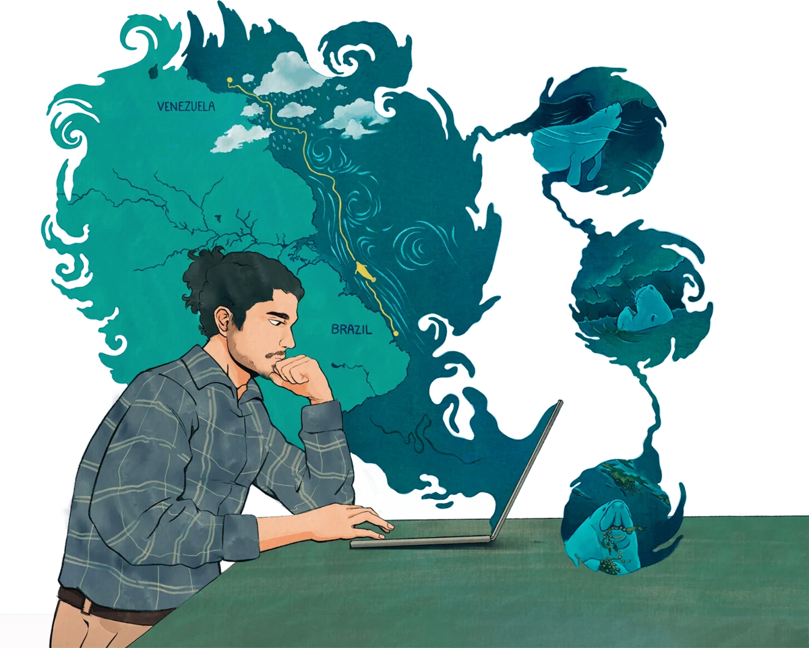
      <div class="carousel-caption">
        <p>Saving Tico - Article at Oceanus Magazine - Illustration by Charin Park</p>
      </div>
    </div>
    <div class="carousel-item">
      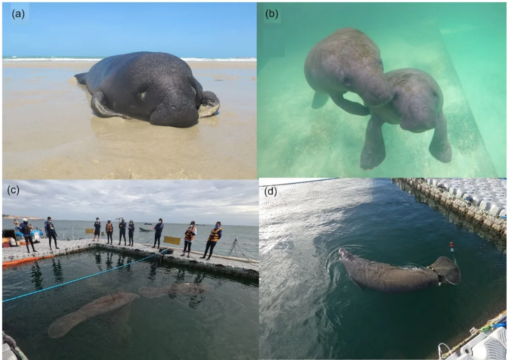
      <div class="carousel-caption">
        <p>Tico and his brother from rescue to release</p>
      </div>
    </div>
    <div class="carousel-item">
      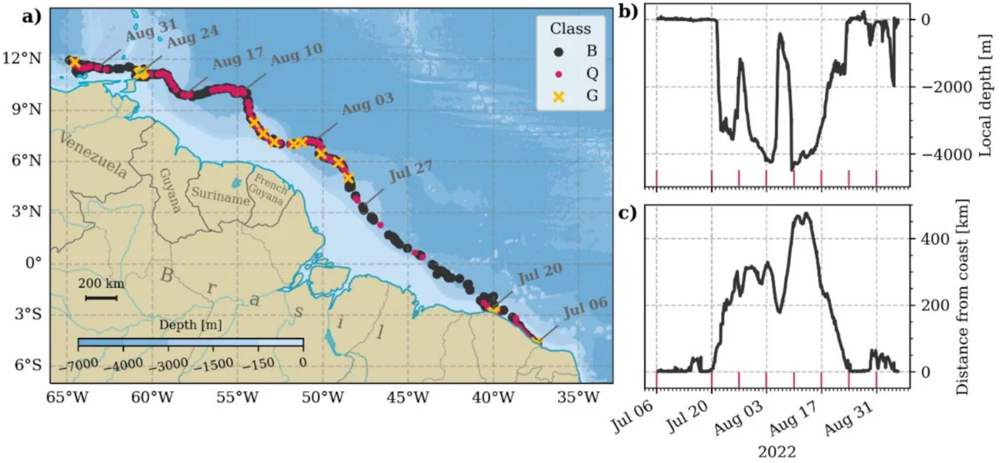
      <div class="carousel-caption">
        <p>Tico's journey from Brazil to Venezuela</p>
      </div>
    </div>
    <div class="carousel-item">
      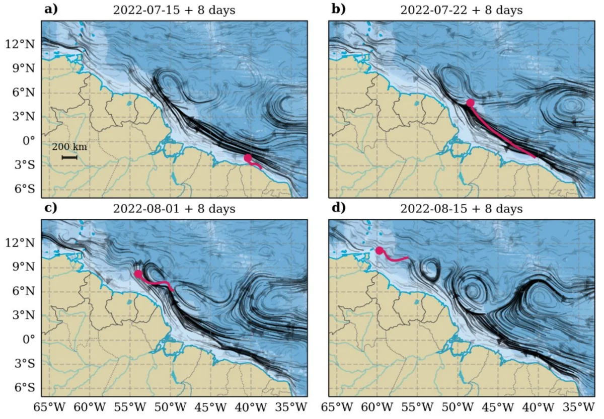
      <div class="carousel-caption">
        <p>Tico surfing the currents</p>
      </div>
    </div>
    <div class="carousel-item">
      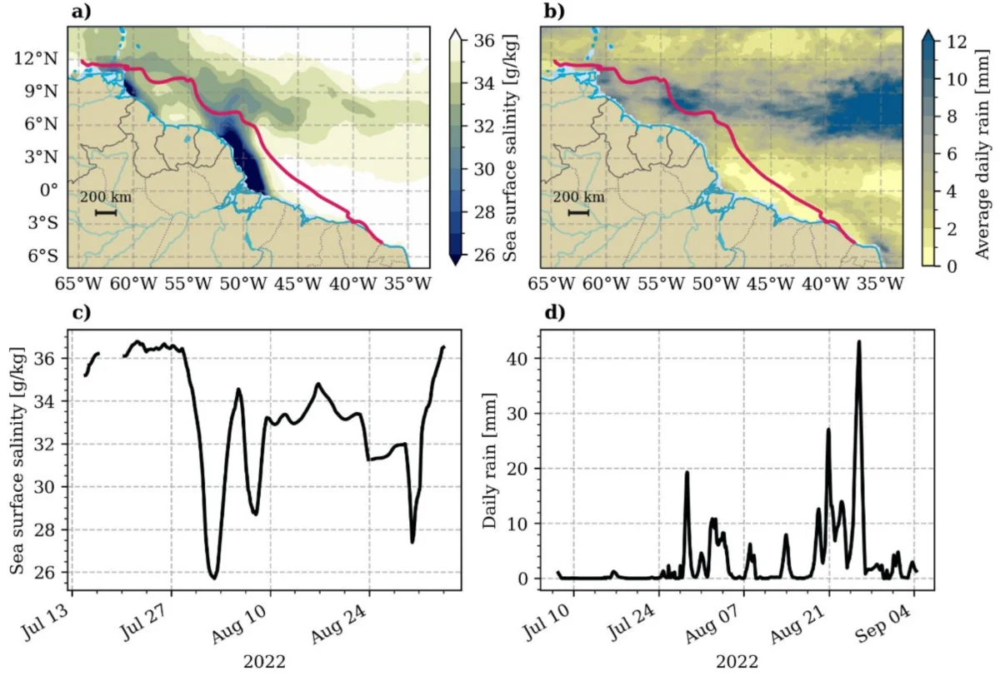
      <div class="carousel-caption">
        <p>Freshwater availability</p>
      </div>
    </div>
  </div>
  <button class="carousel-control-prev" type="button" data-bs-target="#carouselWildlife" data-bs-slide="prev">
    <span class="carousel-control-prev-icon"></span>
  </button>
  <button class="carousel-control-next" type="button" data-bs-target="#carouselWildlife" data-bs-slide="next">
    <span class="carousel-control-next-icon"></span>
  </button>
</div>
```

---

## Multiscale Oceanographic Datasets for Investigating Ocean Dynamics

I use a wide range of ocean-observing technologies, from satellite altimetry and SWOT measurements to DopplerScatt aircraft data, moorings, oceanographic stations, Seagliders, drifters, and Wave Gliders. By combining these observations with advanced data analysis and visualization tools, I study how ocean vortices form, evolve, and move particles.

```{=html}
<div id="carouselMultiscale" class="carousel slide" data-bs-ride="carousel">
  <div class="carousel-inner">
    <div class="carousel-item active">
      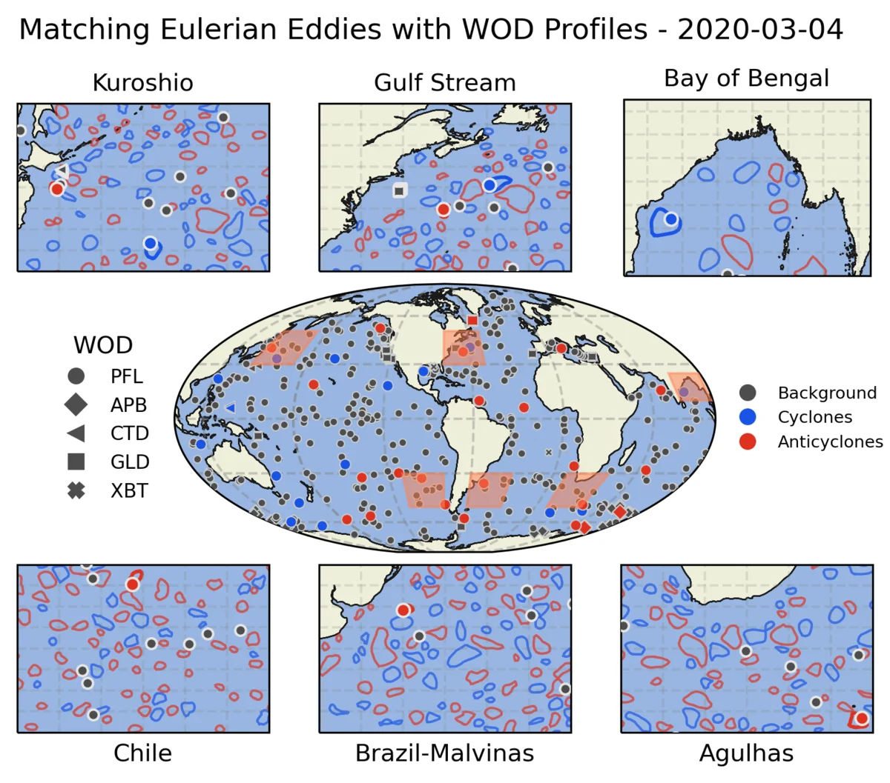
      <div class="carousel-caption">
        <p>Matching altimetry-tracked mesoscale vortices and vertical profiles</p>
      </div>
    </div>
    <div class="carousel-item">
      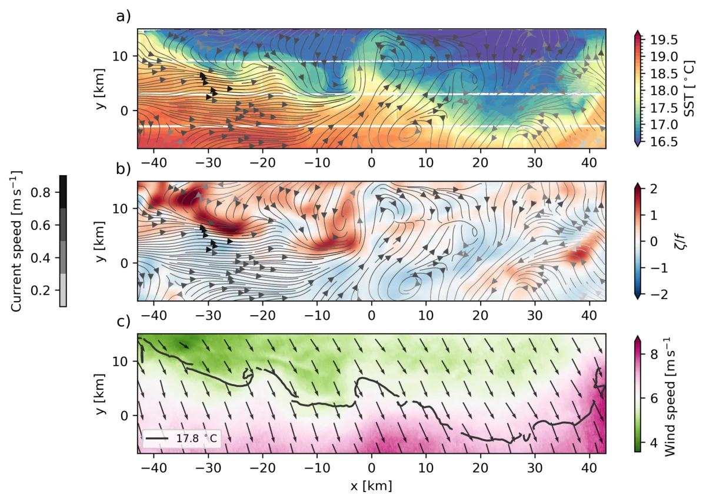
      <div class="carousel-caption">
        <p>High-resolution Doppler Scatterometer and airborne sea surface temperatures</p>
      </div>
    </div>
    <div class="carousel-item">
      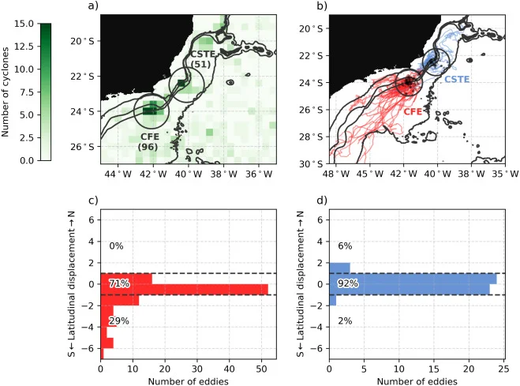
      <div class="carousel-caption">
        <p>Tracking origin and paths of mesoscale vortices</p>
      </div>
    </div>
    <div class="carousel-item">
      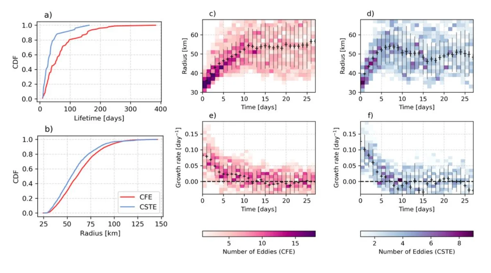
      <div class="carousel-caption">
        <p>The evolution and growth rate of mesoscale vortices</p>
      </div>
    </div>
    <div class="carousel-item">
      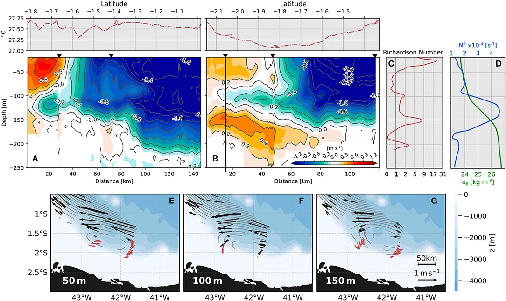
      <div class="carousel-caption">
        <p>Investigating topographic submesoscale vortices close to the Equator</p>
      </div>
    </div>
    <div class="carousel-item">
      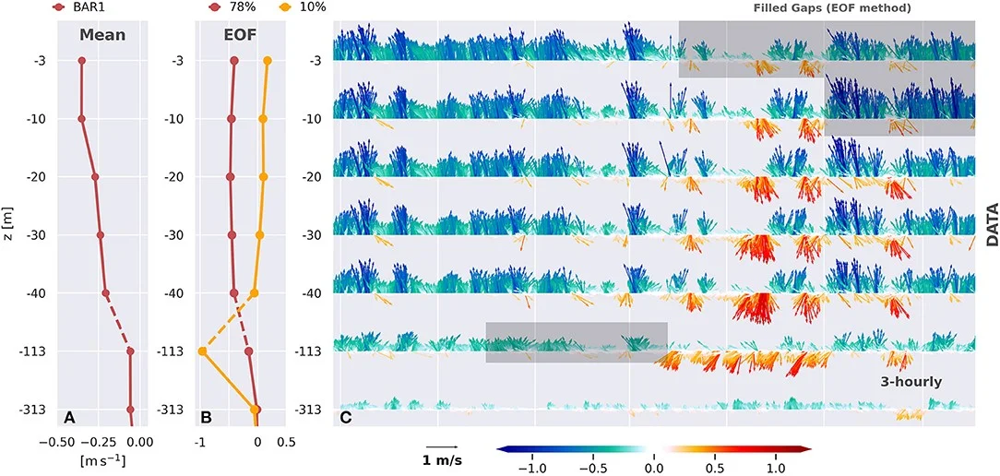
      <div class="carousel-caption">
        <p>Time series processing and analysis of ocean moorings</p>
      </div>
    </div>
    <div class="carousel-item">
      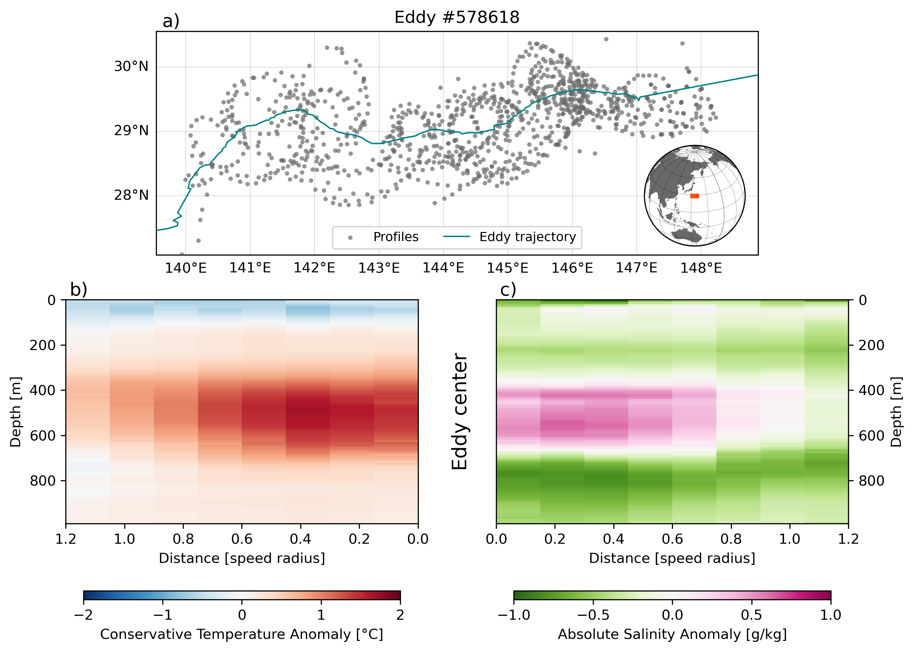
      <div class="carousel-caption">
        <p>Eddy composite analysis combining large ocean datasets and scalable visualization workflows</p>
      </div>
    </div>
  </div>
  <button class="carousel-control-prev" type="button" data-bs-target="#carouselMultiscale" data-bs-slide="prev">
    <span class="carousel-control-prev-icon"></span>
  </button>
  <button class="carousel-control-next" type="button" data-bs-target="#carouselMultiscale" data-bs-slide="next">
    <span class="carousel-control-next-icon"></span>
  </button>
</div>
```

---

## Modeling Vortex Dynamics and Phytoplankton Interactions

Theoretical and interdisciplinary projects on vortex dynamics and biophysical interactions from sub to mesoscale.
Using high-performance computing and GPU-accelerated code, I study how ocean physics and biology interact across scales.
The code for the simulations and analyses of one of the published papers is available on [GitHub](https://github.com/iuryt/NorthAtlanticBloom).

```{=html}
<div id="carouselVortex" class="carousel slide" data-bs-ride="carousel">
  <div class="carousel-inner">
    <div class="carousel-item active">
      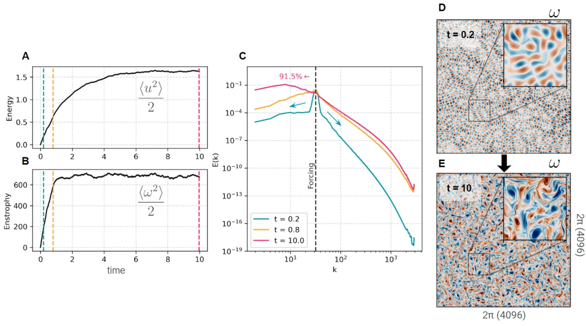
      <div class="carousel-caption">
        <p>Two-dimensional forced turbulence simulations</p>
      </div>
    </div>
    <div class="carousel-item">
      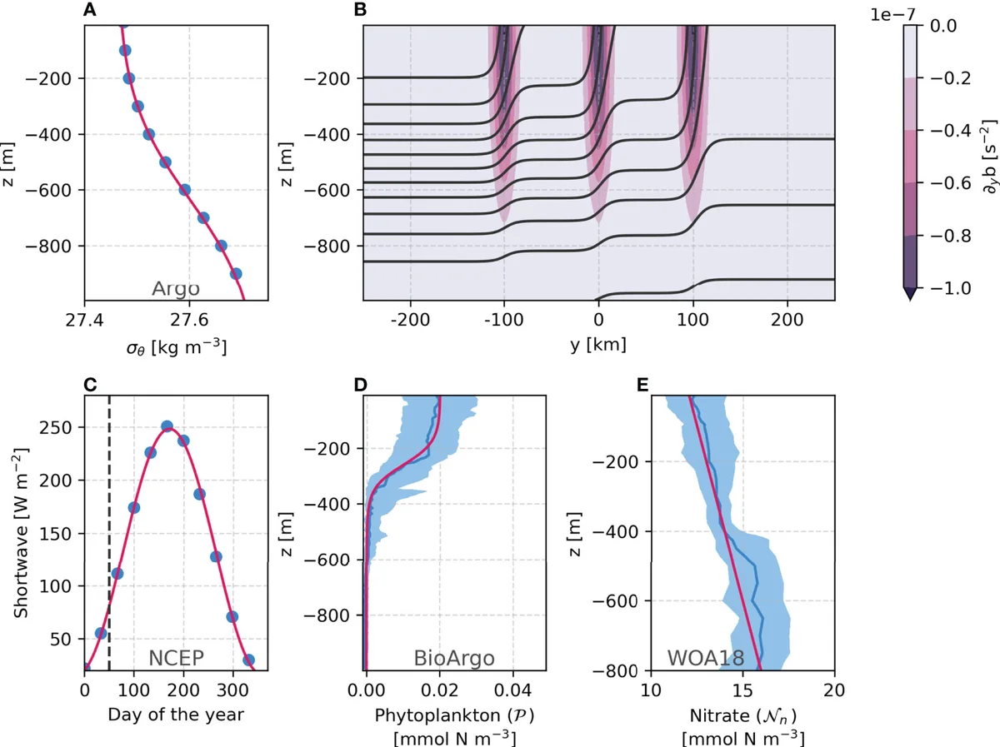
      <div class="carousel-caption">
        <p>Modeling submesoscale fronts and biogeochemical tracers</p>
      </div>
    </div>
    <div class="carousel-item">
      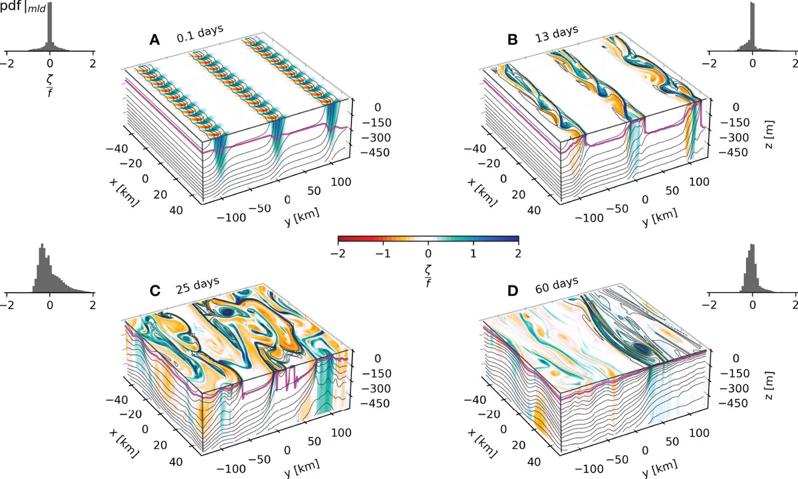
      <div class="carousel-caption">
        <p>Submesoscale process modeling on GPUs</p>
      </div>
    </div>
    <div class="carousel-item">
      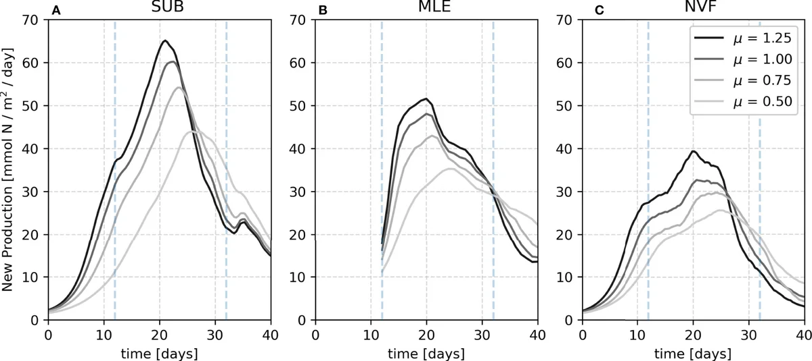
      <div class="carousel-caption">
        <p>Biophysical interactions at multiscale ocean processes</p>
      </div>
    </div>
  </div>
  <button class="carousel-control-prev" type="button" data-bs-target="#carouselVortex" data-bs-slide="prev">
    <span class="carousel-control-prev-icon"></span>
  </button>
  <button class="carousel-control-next" type="button" data-bs-target="#carouselVortex" data-bs-slide="next">
    <span class="carousel-control-next-icon"></span>
  </button>
</div>
```

---

## Air-Sea Interaction in the Indian Ocean

Projects on understanding air-sea interactions in the Indian Ocean and their relationship with Monsoon Rain, both from Atmospheric Sciences and Oceanography perspectives.

```{=html}
<div id="carouselIndianOcean" class="carousel slide" data-bs-ride="carousel">
  <div class="carousel-inner">
    <div class="carousel-item active">
      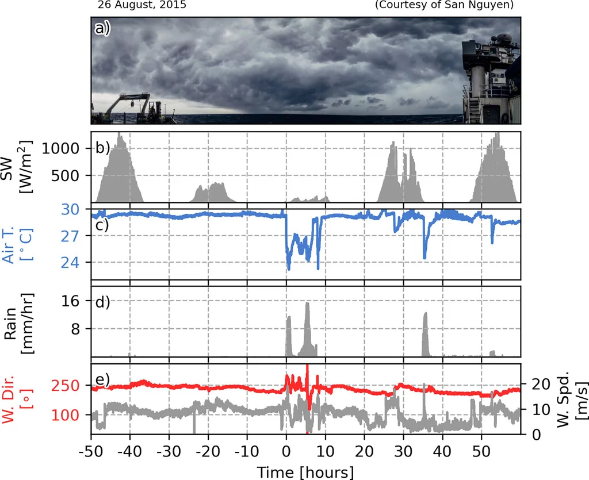
      <div class="carousel-caption">
        <p>Intense atmospheric cool pool in the Bay of Bengal</p>
      </div>
    </div>
    <div class="carousel-item">
      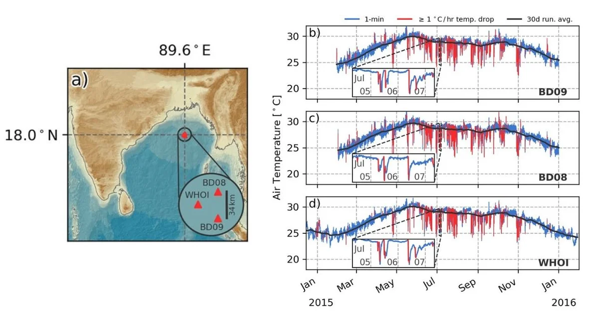
      <div class="carousel-caption">
        <p>Identifying atmospheric cold pools from time series</p>
      </div>
    </div>
    <div class="carousel-item">
      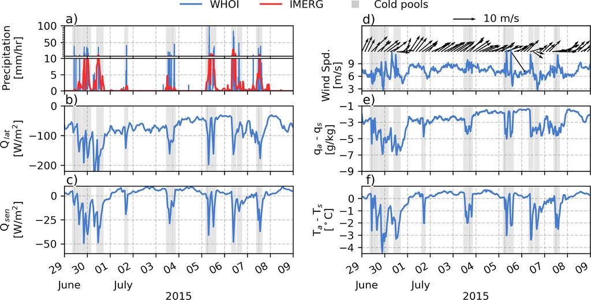
      <div class="carousel-caption">
        <p>The role of atmospheric cold pools on air-sea heat fluxes</p>
      </div>
    </div>
    <div class="carousel-item">
      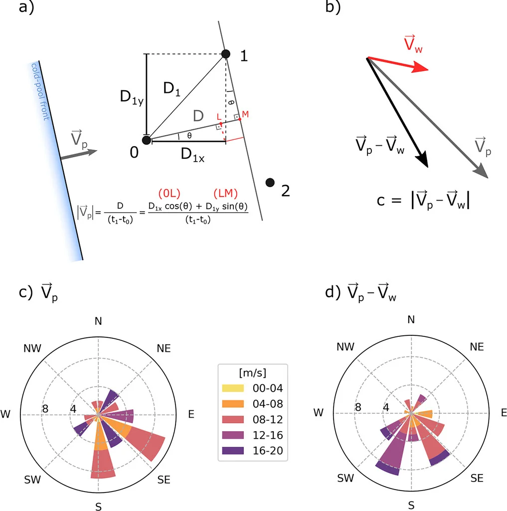
      <div class="carousel-caption">
        <p>Estimating the direction of propagation of cold pools</p>
      </div>
    </div>
    <div class="carousel-item">
      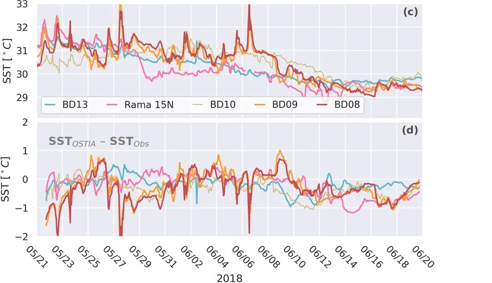
      <div class="carousel-caption">
        <p>Sea surface temperature (SST) biases from satellite products</p>
      </div>
    </div>
    <div class="carousel-item">
      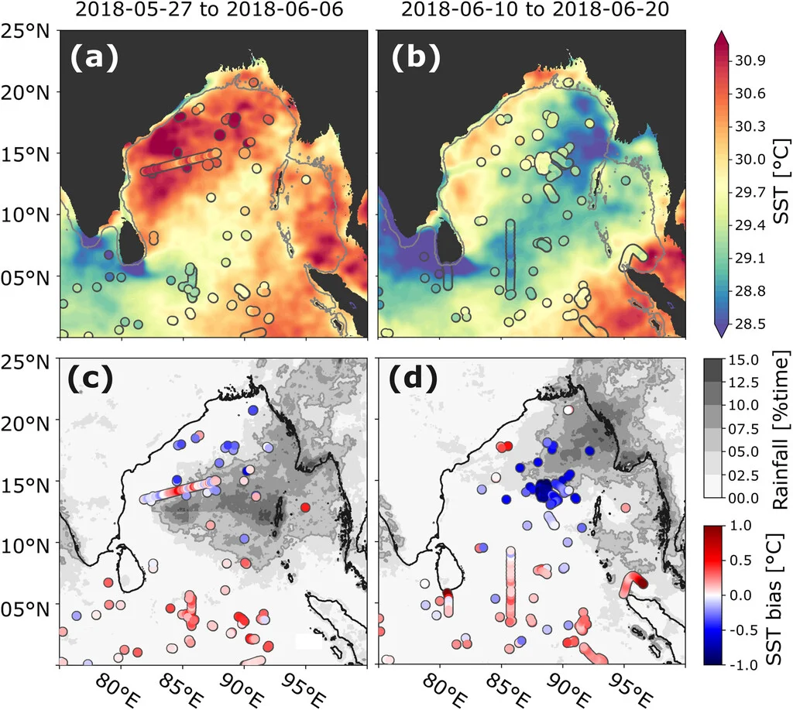
      <div class="carousel-caption">
        <p>Combining multiple datasets to investigate SST biases</p>
      </div>
    </div>
  </div>
  <button class="carousel-control-prev" type="button" data-bs-target="#carouselIndianOcean" data-bs-slide="prev">
    <span class="carousel-control-prev-icon"></span>
  </button>
  <button class="carousel-control-next" type="button" data-bs-target="#carouselIndianOcean" data-bs-slide="next">
    <span class="carousel-control-next-icon"></span>
  </button>
</div>
```

---

## Teaching Initiatives and Experience

As an enthusiast of hands-on teaching experiences, I enjoy finding creative ways for teaching ocean and environmental sciences, such as exploring theory using lab experiments, analyzing real-world examples or running idealized numerical simulations.

```{=html}
<div id="carouselTeaching" class="carousel slide" data-bs-ride="carousel">
  <div class="carousel-inner">
    <div class="carousel-item active">
      <video class="d-block w-100" autoplay loop muted playsinline>
        <source src="img/research/rotating_earth.mp4" type="video/mp4">
      </video>
      <div class="carousel-caption">
        <p>Data visualization for educational purposes (Latitude Dependence of Planetary Vorticity)</p>
      </div>
    </div>
    <div class="carousel-item">
      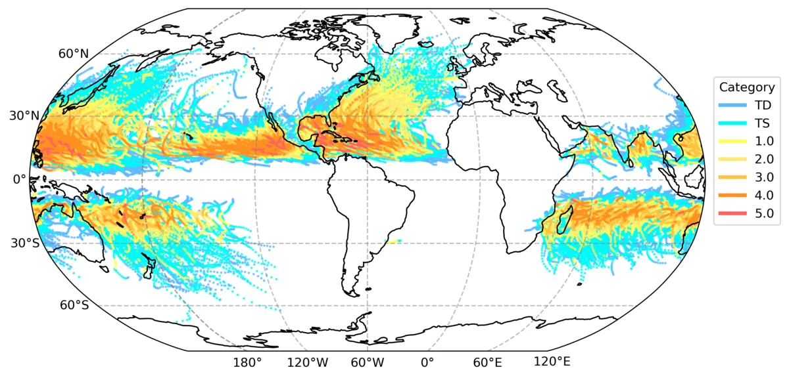
      <div class="carousel-caption">
        <p>Exploring real-world examples along with theory (Hurricane tracks)</p>
      </div>
    </div>
    <div class="carousel-item">
      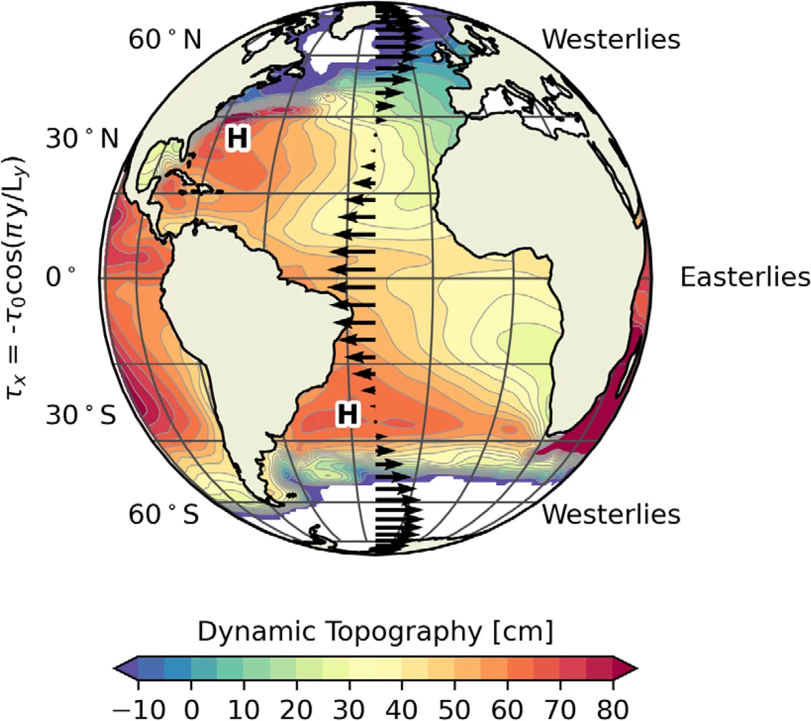
      <div class="carousel-caption">
        <p>Exploring real-world examples along with theory (Winds and Ocean Gyres)</p>
      </div>
    </div>
    <div class="carousel-item">
      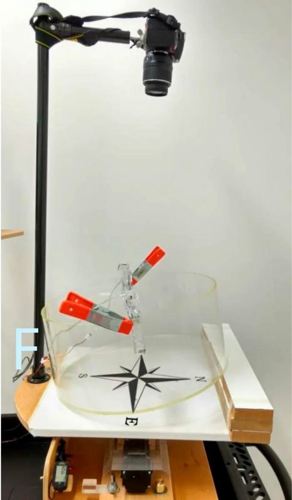
      <div class="carousel-caption">
        <p>Laboratory experiments on rotating tanks</p>
      </div>
    </div>
    <div class="carousel-item">
      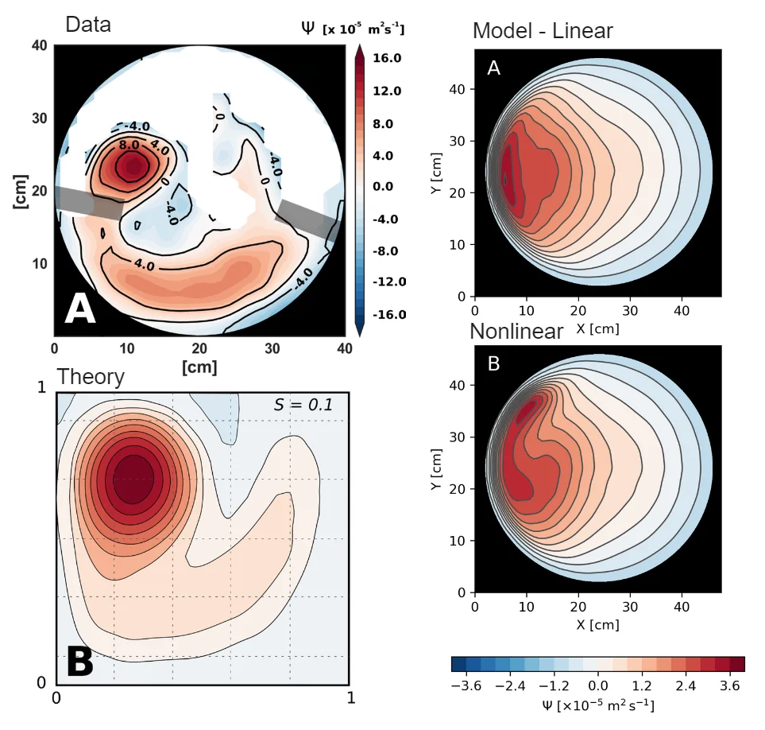
      <div class="carousel-caption">
        <p>Simulating laboratory experiments on rotating tanks</p>
      </div>
    </div>
  </div>
  <button class="carousel-control-prev" type="button" data-bs-target="#carouselTeaching" data-bs-slide="prev">
    <span class="carousel-control-prev-icon"></span>
  </button>
  <button class="carousel-control-next" type="button" data-bs-target="#carouselTeaching" data-bs-slide="next">
    <span class="carousel-control-next-icon"></span>
  </button>
</div>
```
