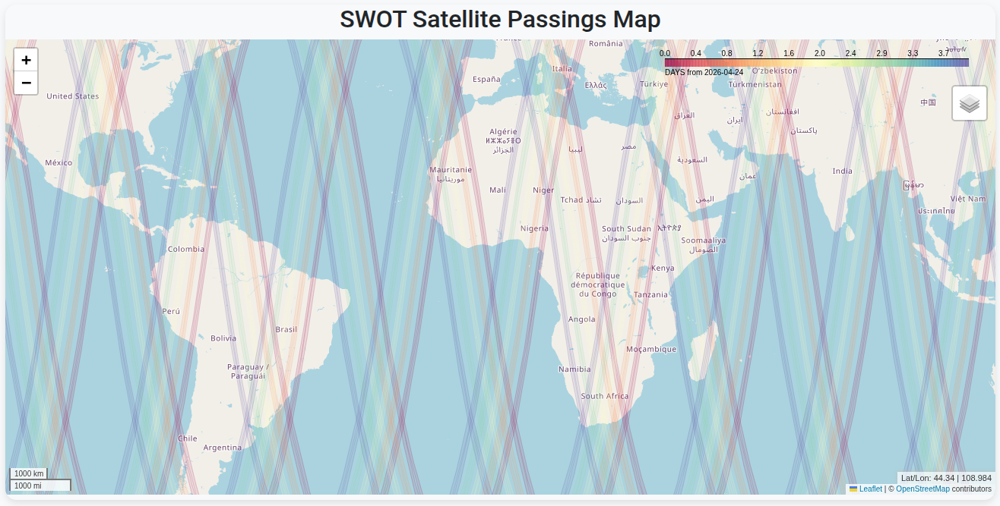
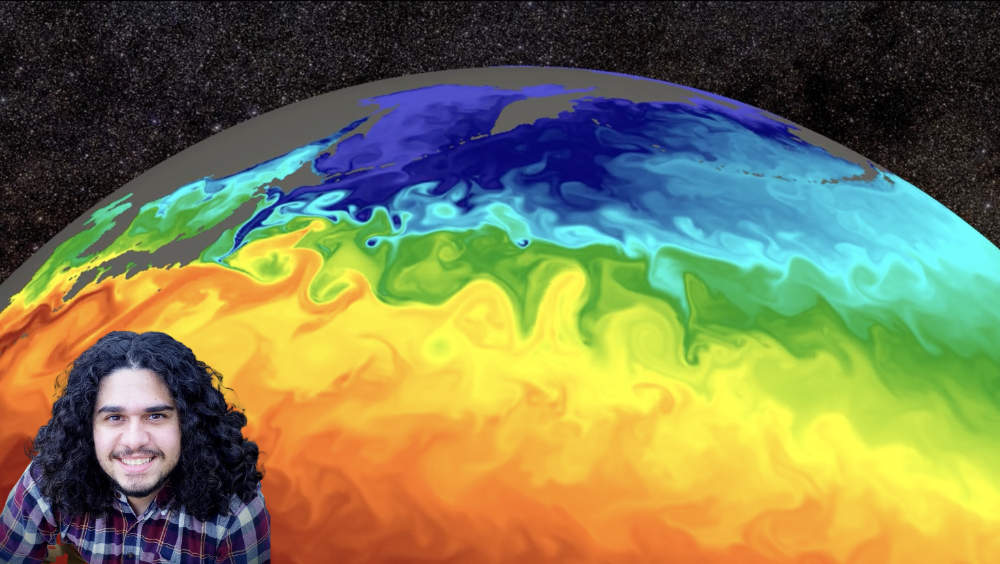

This page highlights software tools and interactive applications related to my research and scientific computing work.

## Where is SWOT?

[{.software-preview}](https://huggingface.co/spaces/iuryt/whereisswot)

[Where is SWOT?](https://huggingface.co/spaces/iuryt/whereisswot) is an interactive app hosted on Hugging Face Spaces for exploring the location of the SWOT satellite.

---

## Tutorials and Resources

### Plotting Big Data Vector Fields with hvPlot and Xarray

[The hvPlot tutorial on large downsampled vector fields](https://hvplot.holoviz.org/en/docs/latest/gallery/big-data/large_vectorfield_downsampled.html) shows how to visualize large vector-field datasets efficiently with `hvplot` and `xarray`.

### Faster Ocean Data Access with Icechunk

[{.software-preview}](https://www.earthmover.io/blog/from-10-minutes-to-10-seconds-how-woods-hole-scientists-used-icechunk-to-optimize-ocean-data-access)

[This Earthmover post](https://www.earthmover.io/blog/from-10-minutes-to-10-seconds-how-woods-hole-scientists-used-icechunk-to-optimize-ocean-data-access) describes how you could use Icechunk to speed up ocean data access workflows.
